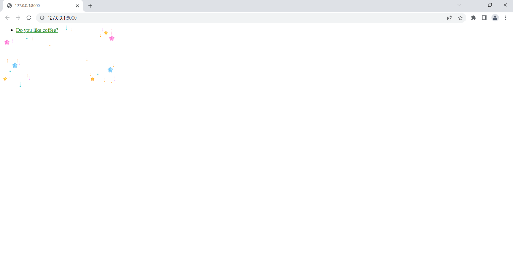
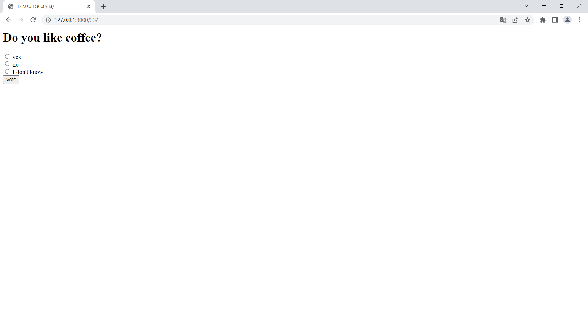

# Polls app

Source link: https://docs.djangoproject.com/en/4.0/

Requirements:

    Python 3.9, SQLite3, Django 4, 


## Quick Start use sqlite3

To get this project up and running locally on your computer:
1. git clone https://github.com/ArsenAjiev/mysite.git

```shell
   pip install -r requirements.txt
   python3 manage.py migrate
   python3 manage.py test 
   python3 manage.py createsuperuser 
```
   
```shell
      # Create questions
      python3 manage.py create_question

```
```shell
      python3 manage.py runserver

```
2. Open tab to `http://127.0.0.1:8000` to see the main site.


1. Home

   
   
2. Vote

   


